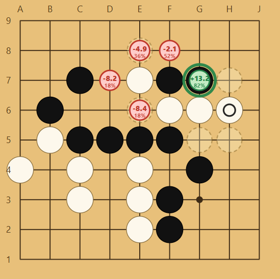

# go-trainer

> 9×9 Go vs KataGo HumanSL — pick from *n* moves, get points-based feedback.



## How it plays
Pick rank (15k→3d) and strategy (`n=5` good-vs-tempting-bad). Board shows *n* faint options; tap one. Values revealed after — halo + predicted points/tiny winrate, rank-graduated colors. 9×9 only.

## Stack
- **App:** Vite + React + TS + `vite-plugin-pwa`, custom SVG board, `@sabaki/go-board`/`sgf`, Zustand
- **Server:** Fastify → `katago analysis` (HumanSL `b18c384nbt-humanv0` + strong net), `rank_*` profiles, `includePolicy` → sample by `humanPolicy`

## Setup

```bash
cd app && npm i && cd ../server && npm i
./server/scripts/download-models.sh  # katago→server/katago, nets→server/models/, libs→server/libs/, cfg→server/config/analysis.cfg
```

Run:

```bash
cd server && KATAGO_MODE=real npm run dev  # :3001
cd app && npm run dev                       # :5173 proxies /api → :3001
curl http://localhost:3001/health
```
