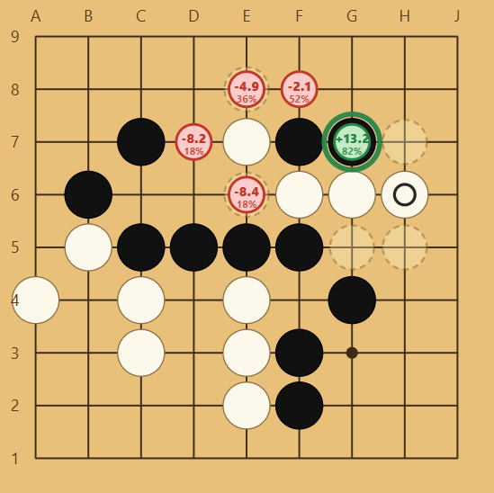

# go-trainer

Practice 9x9 Go against KataGo at your rank.

Go is a board game. Two players, Black and White, place stones to control
territory. This app plays on a small 9x9 board. KataGo is a free AI program
that plays Go.

## What it does

Each turn shows candidate moves. A candidate is one move you may play. You
select one move. The app reveals points feedback. The opponent then replies
with a human-like move.

You play Black or White. You select rank from 30k to 9d. Ranks measure Go
skill. Kyu ranks are student grades: 30k is the weakest, 1k is the
strongest student. Dan ranks are master grades: 1d is the weakest master,
9d is the strongest. Rank steers the human model toward your level.

The winrate graph records each move. Winrate is the estimated chance to win
the game. The graph also works as a review slider. Drag the graph to review
past positions. Two passes end the game. A pass means skipping your turn.
The engine then scores the board. The full game state persists on every
move, so quitting (or rebooting) resumes exactly where you left off.

Free-choice games count toward your rank unless you flip the Ranked toggle to Unranked.
Free choice means you play any move with no suggestions. Rated means the
game counts toward your rank. The rank uses WHR from 30k. WHR (Whole-History
Rating) is a rating system that tracks how skill changes over time. See
`docs/RATINGS.md`. Suggestions games are always unrated. Your rank and
uncertainty show in the setup sheet. Uncertainty measures doubt in the
rank. The chart icon opens the stats screen with your rating history.
Automatch picks the bot rung nearest your target winrate. A rung is one
step on the rank ladder.

## Training styles

The setup sheet selects style and move count. Two sliders pick how many best
and worst moves to show, or free choice with no suggestions. Style sets the
mix of good moves and tempting errors. Feedback color marks each group.

## Build and test

The shipped app is native Android (Kotlin/Compose). Compose is Android's UI
toolkit. Kotlin is the programming language. From the `android` folder:

1. Connect a device with Android 14 or newer.
2. Run `./gradlew installDebug`.
3. Open the app on the device.
4. Tap Download on the setup screen.
5. Wait until the status shows Ready.
6. Tap Start game.

Unit tests: run `./gradlew :app:testDebugUnitTest` from `android`. Pure game
logic (the `game/` package) has no Android imports and carries the unit
tests. Write the test before the feature. Reproduce a bug with a test
before fixing it.

## Engine

The app runs KataGo on the device. The app uses network only for the
one-time model download.

Two nets share the work. A net is one KataGo brain file. A small search net
finds moves. A human net steers selection toward your rank. The search net
ships inside the app. The app downloads the human net once (see
`ModelManager` for the live file names and sizes).

Play uses a persistent board. The engine keeps one board for the whole game
instead of rebuilding it per query. Replies use a small visit budget. A
visit is one simulated continuation of the game. Candidate queries use a
much larger budget (both live in `KataGoGtpEngine`). Typical replies take
under one second on warm hardware. First load takes a few seconds.

Rules are Chinese area scoring with komi 7.5. Komi means White moves second
and receives 7.5 extra points as compensation. Scoring uses engine
`final_score`. The app exports games as SGF. SGF is the standard text format
for Go game records.

## Project layout

- `android`: the shipped app and the on-device engine (Kotlin/Compose, GTP).
  GTP is the text protocol that drives KataGo.
- `app`: web client for development only
- `server`: PC engine for development only
- `docs`: design notes (map below)
- `media`: screenshots

## Docs

| Doc | Status | About |
|-----|--------|-------|
| `docs/ARCHITECTURE.md` | current | How the app fits together |
| `docs/RATINGS.md` | current | WHR rating design |
| `docs/TECH_STACK.md` | current | Shipped stack vs dev-web stack |
| `docs/KATAGO_INTEGRATION.md` | current | On-device engine and models |
| `docs/LEARNING_DESIGN.md` | current | Candidate mix and feedback |
| `docs/NEXT_STEPS.md` | rolling | What comes next |
| `docs/PLAN.md` | historical | Original build checklist, frozen |
| `android/docs/ON_DEVICE.md` | living | Phone-session notes, updated per session |
| `android/docs/ENGINE_PLAN.md` | living | Engine brainstorm, updated per session |
